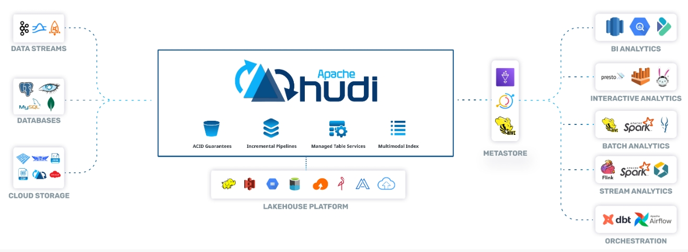

  <h1 align="center">Hudi Data Lake Architecture</h1>
  

    <a href="README_ZH.md"><strong>简体中文</strong></a> | <strong>English</strong>
  

## Table of Contents

- [Repository Introduction](#repository-introduction)  
- [Prerequisites](#prerequisites)  
- [Image Specifications](#image-specifications)
- [Getting Help](#getting-help)
- [How to Contribute](#how-to-contribute)

## Repository Introduction  
[Apache Hudi](https://github.com/apache/Hudi) is an open data lakehouse platform, built on a high-performance open table format to bring database functionality to your data lakes. Hudi reimagines slow old-school batch data processing with a powerful new incremental processing framework for low latency minute-level analytics.

**Core Features:**
1. Data update and deletion: Traditional data lakes typically store files in an immutable form, which makes update and deletion operations complex. Hudi provides efficient upsert (update or insert) and delete operations, simplifying the modification of data.
2. Real time data processing: In scenarios that require real-time processing of data streams, traditional data lakes often struggle to meet low latency requirements. Hudi enables near real-time big data analysis by supporting the writing and incremental pulling of streaming data.
3. Incremental data query: Traditional data lake architectures often require scanning the entire dataset, while Hudi allows users to query based on incremental change data, greatly improving query efficiency.
4. Data consistency: Hudi ensures data consistency during update and delete operations by providing ACID transaction support. This is very important for scenarios that require high data accuracy, such as financial transactions and IoT data.
5. Data version management: Hudi provides time travel functionality, allowing users to access data from a certain historical point in time, facilitating data repair, backtracking, and auditing.

**Architecture Design:**

This project offers pre-configured [**Hudi Data Lake Architecture**](https://marketplace.huaweicloud.com/intl/hidden/contents/482403d6-db7e-49f1-8338-971d505f5871) images with Hudi and its runtime environment pre-installed, along with deployment templates. Follow the guide to enjoy an "out-of-the-box" experience.

> **System Requirements:**
> - CPU: 2GHz or higher  
> - RAM: 4GB or more  
> - Disk: At least 40GB  

## Prerequisites  
[Register a Huawei account and activate Huawei Cloud](https://support.huaweicloud.com/usermanual-account/account_id_001.html)

## Image Specifications  

| Image Version                                                  | Description                                             | Notes |  
|----------------------------------------------------------------|---------------------------------------------------------|-------|  
| [Hudi1.0.0-kunpeng-v1.0](https://github.com/HuaweiCloudDeveloper/Hudi-image/tree/Hudi1.0.0-kunpeng-v1.0) | Deployed on Kunpeng servers with Huawei Cloud EulerOS 2.0 64bit |  | 
| [Hudi1.0.0-kunpeng-v1.0](https://github.com/HuaweiCloudDeveloper/Hudi-image/tree/Hudi1.0.0-kunpeng-v1.0) | Deployed on Kunpeng servers with Ubuntu24.04 64bit   |  |  

## Getting Help
- Submit an [issue](https://github.com/HuaweiCloudDeveloper/Hudi-image/issues)
- Contact Huawei Cloud Marketplace product support

## How to Contribute
- Fork this repository and submit a merge request.
- Update README.md synchronously based on your open-source mirror information.
