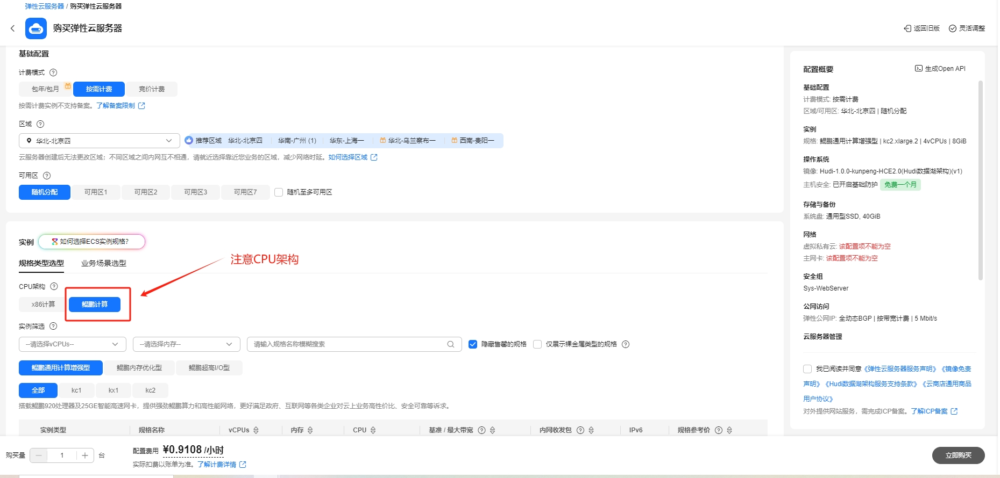
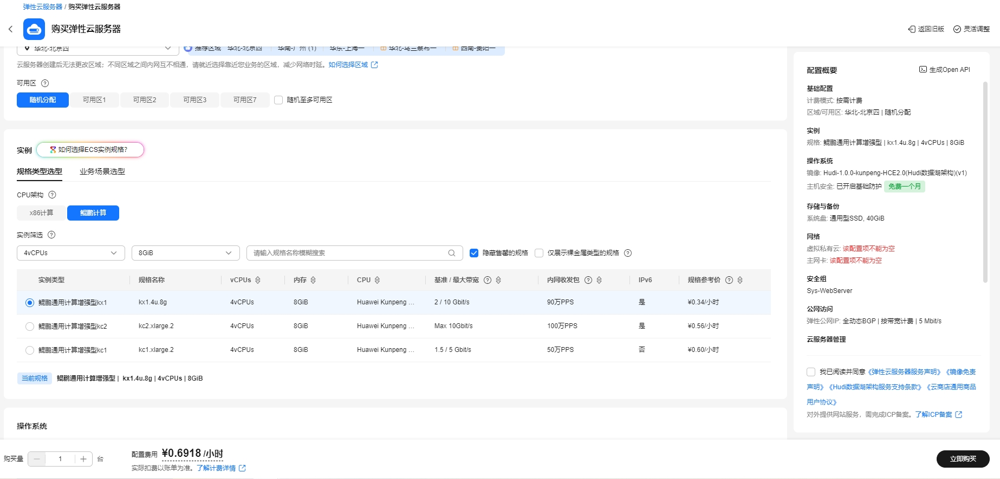
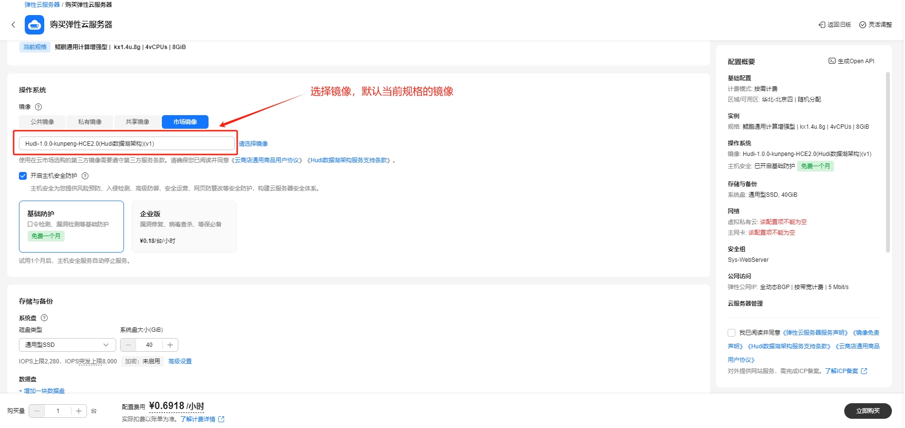
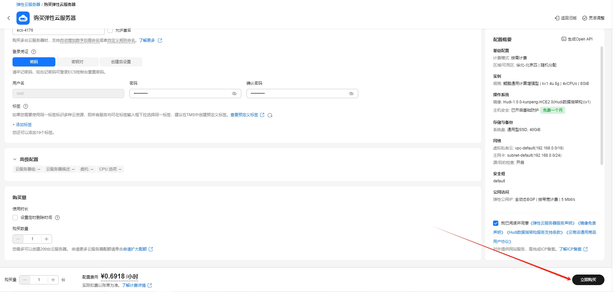

# Hudi数据湖架构使用指南

# 一、商品链接

[Hudi数据湖架构](https://marketplace.huaweicloud.com)

# 二、商品说明

**Apache Hudi** 是一种数据湖管理工具。它为数据湖提供了事务支持，能够实现对数据湖中的数据进行插入、更新和删除操作，并且可以跟踪数据的变化，方便进行增量数据处理和分析。

# 三、商品购买

您可以在云商店搜索 **Hudi数据湖架构**。

其中，地域、规格、推荐配置使用默认，购买方式根据您的需求选择按需/按月/按年，短期使用推荐按需，长期使用推荐按月/按年，确认配置后点击“立即购买”。


## 3.1 使用 RFS 模板直接部署

必填项填写后，点击 下一步


创建直接计划后，点击 确定


点击部署，执行计划

如下图“Apply required resource success. ”即为资源创建完成


##  3.2 ECS 控制台配置

### 准备工作

在使用ECS控制台配置前，需要您提前配置好 **安全组规则**。

> **安全组规则的配置如下：**
> - 入方向规则 建议放通所有端口,如指定端口,对应的源地址内必须包含您的客户端ip，否则无法访问 
> - 入方向规则放通 CloudShell 连接实例使用的端口 `22`，以便在控制台登录调试
> - 出方向规则一键放通

### 创建ECS

前提工作准备好后，选择 ECS 控制台配置跳转到[购买ECS](https://support.huaweicloud.com/qs-ecs/ecs_01_0103.html) 页面，ECS 资源的配置如下图所示：

选择CPU架构

选择服务器规格

选择镜像

其他参数根据实际情况进行填写，填写完成之后，点击立即购买即可



> **值得注意的是：**
> - VPC 您可以自行创建
> - 安全组选择 [**准备工作**](#准备工作) 中配置的安全组；
> - 弹性公网IP选择现在购买，推荐选择“按流量计费”，带宽大小可设置为5Mbit/s；
> - 高级配置需要在高级选项支持注入自定义数据，所以登录凭证不能选择“密码”，选择创建后设置；
> - 其余默认或按规则填写即可。

# 四、商品使用

## 修改服务器域名
```shell
vim /etc/hosts
```  
x.x.x.x hadoop1  修改成本机服务器ip

## hadoop用户重新生成免密
* 删除旧密钥文件  
```shell
su - hadoop  
cd .ssh  
rm -rf id_rsa  id_rsa.pub  known_hosts  
```

* 免密登录
```shell
ssh-keygen -t rsa  
ssh-copy-id hadoop1		-- hadoop 密码 例如 123456  
```

## 启动hadoop服务器
```shell
/opt/module/hadoop-3.3.4/sbin/start-all.sh
```

## 启动flink服务
```shell
/opt/module/flink-1.20.1/bin/start-cluster.sh
```
## 进入flink sqlclient交互界面
```shell
sql-client.sh embedded
```

```flink-sql
SET sql-client.execution.result-mode=tableau;
```

### Hudi样例

* 创建Hudi表 指定 name 为主键
```flink sql
CREATE TABLE t1(
  name VARCHAR(10) PRIMARY KEY NOT ENFORCED,  -- 显式定义主键
  age INT
)
WITH (
  'connector' = 'hudi',
  'path' = 'hdfs://hadoop1:8020/data/hudi_flink/t1',
  'table.type' = 'MERGE_ON_READ'
); 
```

* 第一次插入数据(新增数据 insert场景)
```flink sql
INSERT INTO t1 VALUES ('test_user', 30);
select * from t1 ;
```

* 第二次修改数据(upsert数据场景)
```flink sql
INSERT INTO t1 VALUES ('test_user', 32);
select * from t1 ;
```

## 参考文档

[Hudi官网](https://Hudi.apache.org/)
